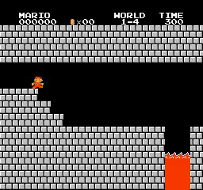
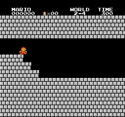
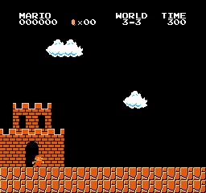
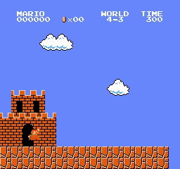
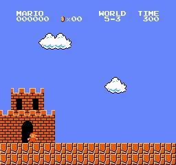

# Mario_PPO_RND
Playing Super Mario Bros with Proximal Policy Optimization (PPO) and Random Network Distillation (RND)

## Introduction

My PyTorch Proximal Policy Optimization (PPO) + Random Network Distillation (RND) implement to playing Super Mario Bros. There are [PPO paper](https://arxiv.org/abs/1707.06347) and [RND paper](https://arxiv.org/abs/1810.12894).

  
  
  
   
  
  
  
   
  
  
  
   
  
  
  
   
  
  
  
   
  
  
  
   
  
  
  
   
  
  
  
   
  <i>Results</i>

## Motivation

I just tried both [A2C](https://github.com/CVHvn/Mario_A2C) and [PPO](https://github.com/CVHvn/Mario_PPO) but my algorithms can't completed the hardest stage (stage 8-4). PPO only help Mario completed 31/32 stages. When I try to play stage 8-4 with PPO, I meet three problems:
- The reward system is very bad than Mario can't completed this stage: Mario still earn reward when he move in the loop. I solved it same as stage 4-4 and 7-4.
- The coordinate system is very poor. I find that some x_pos is duplicated:
  - The first exact pipe has duplicate coordinates and is smaller than the road ahead.
  - The sea map has its x coordinates reset.
  - Then, I need hard code to define reward system: Determine each x coordinate segment as a repeated line segment to set done = True and give a negative reward.
- Mario need find hidden brick to complete this stage:
  - There is a water pipe that Mario must jump onto a hidden brick before entering it
  - If Mario goes right through the water pipe, Mario will enter a looped road
  - Map was long before Mario was forced to discover this secret
  - If we just prevent Mario from going right (avoiding the repeating path) as usual, he will learn that staying still is the best way instead of trying to find the hidden brick .
  - I tried some strategies for PPO but it wasn't effective enough, so I looked for other methods to let Agent explore better, and I combined RND into PPO to solve stage 8-4:
    - Give 50 rewards when Mario finds hidden bricks
    - Give 50 rewards when Mario when Mario goes down the right pipe
    - Deduct more points when Mario goes around the repeating path at hidden brick
    - I chose the last strategy because it seemed the fairest. Other strategies don't actually encourage Mario to explore the environment for the brick, but rather just force it to follow the right path.
  - Note: Actually, Mario can learn how to double jump to jump on the pipe without finding the brick, but this is very difficult and requires a lot of luck, difficult to recreate if you train again.

## How to use it

You can use my notebook for training and testing agent very easy:
* **Train your model** by running all cell before session test
* **Test your trained model** by running all cell except agent.train(), just pass your model path to agent.load_model(model_path)

Or you can use **train.py** and **test.py** if you don't want to use notebook:
* **Train your model** by running **train.py**: For example training for stage 1-4: python train.py --world 1 --stage 4 --num_envs 8
* **Test your trained model** by running **test.py**: For example testing for stage 1-4: python test.py --world 1 --stage 4 --pretrained_model best_model.pth --num_envs 2

## Trained models

You can find trained model in folder [trained_model](trained_model)

## Hyperparameters

How I find hyperparameters for each stage:
- First, I find optimal hyperparameters for stages 8-4 (I do this project just to complete this stage because normal PPO wins 31/32 other stages):
  - I find that a larger num environment works better because it explores more things when run parallel. I set the num environment to 32 (when testing normal PPO, when the num environment is larger than 16, it has no effect).
  As I saw with PPO, learn_step needs more than episode_step to stable training (except for easy stages) because the model will see a correct return. Then I set learn_step to 756.
  - Because I can’t set the batch size to 64 (doesn’t work and requires a smaller update_proportion) I just set a batch size to 256.
  - I try to tune gamma and gamma_int in the range (0.9, 0.95, 0.99, 0.999) and I find that gamma = 0.99, gamma_int = 0.99 work better.
  - I set update_proportion to 0.25 as [jcwleo RND](https://github.com/jcwleo/random-network-distillation-pytorch/blob/master/agents.py). When training stages 8-4, I don’t change this param then I don’t realize the correlation between update_proportion and batch size (larger batch size requires smaller update_proportion, I will discuss it later)
  - I tuned int_adv_coef and ext_adv_coef, I found that int_adv_coef = 1 and	ext_adv_coef = 2 work better.
  - I tuned entropy_coef = 0.01 and 0.05 and found that 0.05 works better (because we need more exploration)
  - I don’t change epoch = 10, lambda = 0.95, learning_rate = 7e-5, target_kl = 0.05, clip_param = 0.05, max_grad_norm = 0.5, norm_adv = False, V_coef = 0.5 and loss_type = ‘mse’ (because I think it is best when tuning normal PPO, just my bias experiment)
- After having optimal hyperparameters for stages 8-4, I use it as default and win almost all stages (just change the num environment to 8 or 16)
  - With other stages, I can’t complete with default hyperparameters and I see that RND just makes training time slower (compared with normal PPO), so I set int_adv_coef = 0.1 and ext_adv_coef = 1. These hyperparameters help me complete more hard stages (You can back to normal PPO, but if I want to test RND then I don’t want to disable RND)
  - Now, I only have some hard stages. I think that when I set the batch size to 64, RND updates more time than intrinsic rewards not working, I tried to set update_proportion = 0.05 and batch size to 64, then the algorithm worked and I completed more stages.
  - Finally, I set loss_type to ‘hyber’ and completed all stages.
  - I randomly tuned entropy_coef between 0.01 and 0.05 (I don’t have enough evidence about effect of this hyperparameter)
- Noted: RL is very sensitive to hyperparameters, and some hyperparameters work with these stages but don’t work with other stages. Then we need custom hyperparameters for some hard stages like 5-3, 7-2, 8-1, 8-4. I don’t have enough time and resources to find optimal hyperparameters that can complete all stages.

| World | Stage | num_envs | learn_step | batchsize | epoch | lambda | gamma | gamma_int | learning_rate | target_kl | clip_param | max_grad_norm | update_proportion  | norm_adv | int_adv_coef | ext_adv_coef | V_coef | entropy_coef | loss_type | training_step | training_time |
|-------|-------|----------|------------|-----------|-------|--------|-------|-----------|---------------|-----------|------------|---------------|--------|----------|--------------|--------------|--------|--------------|-----------|---------------|---------------|
| default     |      | 8        | 512        | 256       | 10    | 0.95   | 0.99  | 0.99      | 7.00E-05      | 0.05      | 0.2        | 0.5           | 0.25   | FALSE    | 1            | 2            | 0.5    | 0.05         | mse       | 435990        | 5:30:41       |
| 1     | 1     | 8        | 512        | 256       | 10    | 0.95   | 0.99  | 0.99      | 7.00E-05      | 0.05      | 0.2        | 0.5           | 0.25   | FALSE    | 1            | 2            | 0.5    | 0.05         | mse       | 435990        | 5:30:41       |
| 1     | 2     | 8        | 512        | 256       | 10    | 0.95   | 0.99  | 0.99      | 7.00E-05      | 0.05      | 0.2        | 0.5           | 0.25   | FALSE    | 1            | 2            | 0.5    | 0.05         | mse       | 467440        | 7:43:46       |
| 1     | 3     | 16       | 512        | 64        | 10    | 0.95   | 0.99  | 0.99      | 7.00E-05      | 0.05      | 0.2        | 0.5           | 0.05   | FALSE    | 0.1          | 1            | 0.5    | 0.05         | mse       | 444917        | 15:32:29      |
| 1     | 4     | 8        | 512        | 256       | 10    | 0.95   | 0.99  | 0.99      | 7.00E-05      | 0.05      | 0.2        | 0.5           | 0.25   | FALSE    | 1            | 2            | 0.5    | 0.05         | mse       | 64982         | 0:42:23       |
| 2     | 1     | 8        | 512        | 256       | 10    | 0.95   | 0.99  | 0.99      | 7.00E-05      | 0.05      | 0.2        | 0.5           | 0.25   | FALSE    | 1            | 2            | 0.5    | 0.05         | mse       | 1202627       | 14:45:26      |
| 2     | 2     | 16       | 512        | 256       | 10    | 0.95   | 0.99  | 0.99      | 7.00E-05      | 0.05      | 0.2        | 0.5           | 0.25   | FALSE    | 0.1          | 1            | 0.5    | 0.01         | mse       | 1876990       | 1 day, 18:37:18 |
| 2     | 3     | 8        | 512        | 256       | 10    | 0.95   | 0.99  | 0.99      | 7.00E-05      | 0.05      | 0.2        | 0.5           | 0.25   | FALSE    | 1            | 2            | 0.5    | 0.05         | mse       | 392697        | 6:06:10       |
| 2     | 4     | 8        | 512        | 256       | 10    | 0.95   | 0.99  | 0.99      | 7.00E-05      | 0.05      | 0.2        | 0.5           | 0.25   | FALSE    | 1            | 2            | 0.5    | 0.05         | mse       | 145339        | 2:16:03       |
| 3     | 1     | 16       | 512        | 256       | 10    | 0.95   | 0.99  | 0.99      | 7.00E-05      | 0.05      | 0.2        | 0.5           | 0.25   | FALSE    | 1            | 2            | 0.5    | 0.05         | mse       | 193534        | 4:51:21       |
| 3     | 2     | 8        | 512        | 256       | 10    | 0.95   | 0.99  | 0.99      | 7.00E-05      | 0.05      | 0.2        | 0.5           | 0.25   | FALSE    | 1            | 2            | 0.5    | 0.05         | mse       | 195001        | 3:15:37       |
| 3     | 3     | 16       | 512        | 256       | 10    | 0.95   | 0.99  | 0.99      | 7.00E-05      | 0.05      | 0.2        | 0.5           | 0.25   | FALSE    | 1            | 2            | 0.5    | 0.05         | mse       | 843736        | 16:24:42      |
| 3     | 4     | 8        | 512        | 256       | 10    | 0.95   | 0.99  | 0.99      | 7.00E-05      | 0.05      | 0.2        | 0.5           | 0.25   | FALSE    | 1            | 2            | 0.5    | 0.05         | mse       | 118255        | 1:39:47       |
| 4     | 1     | 8        | 512        | 256       | 10    | 0.95   | 0.99  | 0.99      | 7.00E-05      | 0.05      | 0.2        | 0.5           | 0.25   | FALSE    | 1            | 2            | 0.5    | 0.05         | mse       | 219639        | 2:39:24       |
| 4     | 2     | 16       | 512        | 256       | 10    | 0.95   | 0.99  | 0.99      | 7.00E-05      | 0.05      | 0.2        | 0.5           | 0.25   | FALSE    | 1            | 2            | 0.5    | 0.05         | mse       | 417239        | 10:34:17      |
| 4     | 3     | 16       | 512        | 256       | 10    | 0.95   | 0.99  | 0.99      | 7.00E-05      | 0.05      | 0.2        | 0.5           | 0.25   | FALSE    | 0.1          | 1            | 0.5    | 0.01         | mse       | 211948        | 5:19:50       |
| 4     | 4     | 16       | 512        | 256       | 10    | 0.95   | 0.99  | 0.99      | 7.00E-05      | 0.05      | 0.2        | 0.5           | 0.25   | FALSE    | 1            | 2            | 0.5    | 0.05         | mse       | 111064        | 2:48:40       |
| 5     | 1     | 8        | 512        | 256       | 10    | 0.95   | 0.99  | 0.99      | 7.00E-05      | 0.05      | 0.2        | 0.5           | 0.25   | FALSE    | 1            | 2            | 0.5    | 0.05         | mse       | 268275        | 3:11:07       |
| 5     | 2     | 8        | 512        | 256       | 10    | 0.95   | 0.99  | 0.99      | 7.00E-05      | 0.05      | 0.2        | 0.5           | 0.25   | FALSE    | 1            | 2            | 0.5    | 0.05         | mse       | 1891820       | 1 day, 0:59:46 |
| 5     | 3     | 16       | 512        | 64        | 10    | 0.95   | 0.99  | 0.99      | 7.00E-05      | 0.05      | 0.2        | 0.5           | 0.05   | FALSE    | 0.1          | 1            | 0.5    | 0.05         | huber     | 1739262       | 2 days, 2:44:45 |
| 5     | 4     | 16       | 512        | 256       | 10    | 0.95   | 0.99  | 0.99      | 7.00E-05      | 0.05      | 0.2        | 0.5           | 0.25   | FALSE    | 1            | 2            | 0.5    | 0.05         | mse       | 370659        | 9:21:28       |
| 6     | 1     | 8        | 512        | 256       | 10    | 0.95   | 0.99  | 0.99      | 7.00E-05      | 0.05      | 0.2        | 0.5           | 0.25   | FALSE    | 1            | 2            | 0.5    | 0.05         | mse       | 244212        | 3:03:29       |
| 6     | 2     | 16       | 512        | 256       | 10    | 0.95   | 0.99  | 0.99      | 7.00E-05      | 0.05      | 0.2        | 0.5           | 0.25   | FALSE    | 1            | 2            | 0.5    | 0.05         | mse       | 535523        | 11:57:35      |
| 6     | 3     | 16       | 512        | 256       | 10    | 0.95   | 0.99  | 0.99      | 7.00E-05      | 0.05      | 0.2        | 0.5           | 0.25   | FALSE    | 1            | 2            | 0.5    | 0.01         | mse       | 153598        | 2:46:04       |
| 6     | 4     | 8        | 512        | 256       | 10    | 0.95   | 0.99  | 0.99      | 7.00E-05      | 0.05      | 0.2        | 0.5           | 0.25   | FALSE    | 1            | 2            | 0.5    | 0.05         | mse       | 498686        | 5:42:43       |
| 7     | 1     | 8        | 512        | 256       | 10    | 0.95   | 0.99  | 0.99      | 7.00E-05      | 0.05      | 0.2        | 0.5           | 0.25   | FALSE    | 1            | 2            | 0.5    | 0.05         | mse       | 500220        | 6:06:49       |
| 7     | 2     | 16       | 512        | 64        | 10    | 0.95   | 0.99  | 0.99      | 7.00E-05      | 0.05      | 0.2        | 0.5           | 0.05   | FALSE    | 0.1          | 1            | 0.5    | 0.05         | mse       | 3218417       | 2 days, 23:13:37 |
| 7     | 3     | 8        | 512        | 256       | 10    | 0.95   | 0.99  | 0.99      | 7.00E-05      | 0.05      | 0.2        | 0.5           | 0.25   | FALSE    | 1            | 2            | 0.5    | 0.05         | mse       | 398336        | 4:39:01       |
| 7     | 4     | 8        | 512        | 256       | 10    | 0.95   | 0.99  | 0.99      | 7.00E-05      | 0.05      | 0.2        | 0.5           | 0.25   | FALSE    | 1            | 2            | 0.5    | 0.05         | mse       | 201684        | 2:56:41       |
| 8     | 1     | 16       | 512        | 64        | 10    | 0.95   | 0.99  | 0.99      | 7.00E-05      | 0.05      | 0.2        | 0.5           | 0.05   | FALSE    | 0.1          | 1            | 0.5    | 0.05         | huber     | 3058672       | 3 days, 22:58:34 |
| 8     | 2     | 16       | 512        | 256       | 10    | 0.95   | 0.99  | 0.99      | 7.00E-05      | 0.05      | 0.2        | 0.5           | 0.25   | FALSE    | 1            | 2            | 0.5    | 0.05         | mse       | 723940        | 17:21:15      |
| 8     | 3     | 16       | 512        | 256       | 10    | 0.95   | 0.99  | 0.99      | 7.00E-05      | 0.05      | 0.2        | 0.5           | 0.25   | FALSE    | 1            | 2            | 0.5    | 0.05         | mse       | 593399        | 13:29:12      |
| 8     | 4     | 32       | 756        | 256       | 10    | 0.95   | 0.99  | 0.99      | 7.00E-05      | 0.05      | 0.2        | 0.5           | 0.25   | FALSE    | 1            | 2            | 0.5    | 0.05         | mse       | 985820        | 1 day, 7:48:34 |

## Questions

* Is this code guaranteed to complete the stages if you try training?
  
  - This hyperparameter does not guarantee you will complete the stage. But I am sure that you can win with this hyperparameter except you have a unlucky day (need 2-3 times to win because of randomness)

* How long do you train agents?
  
  - Within a few hours to more than 1 day. Time depends on hardware, I use many different hardware so time will not be accurate.

* How can you improve this code?
  
  - You can separate the test agent part into a separate thread or process. I'm not good at multi-threaded programming so I don't do this.

* What is the importance of RND?

  - RND mainly helps complete stage 8-4, which requires more exploration. 
  - Personally, I feel it doesn't help other stages and slows down the training speed. 
  - RND adds many hyperparameters making it difficult to choose hyperparameters. But we all know that hyperparameters greatly affect RL.

## Requirements

* **python 3>3.6**
* **gym==0.25.2**
* **gym-super-mario-bros==7.4.0**
* **imageio**
* **imageio-ffmpeg**
* **cv2**
* **pytorch** 
* **numpy**

## Acknowledgements
With my code, I can completed all 32/32 stages of Super Mario Bros. This code included new custom reward system (for stage 8-4) and PPO+RND for agent training.

## Reference
* [CVHvn PPO](https://github.com/CVHvn/Mario_PPO)
* [Stable-baseline3 PPO](https://stable-baselines3.readthedocs.io/en/master/_modules/stable_baselines3/ppo/ppo.html#PPO)
* [lazyprogrammer A2C](https://github.com/lazyprogrammer/machine_learning_examples/tree/master/rl3/a2c)
* [jcwleo RND](https://github.com/jcwleo/random-network-distillation-pytorch/blob/master/utils.py)
* [DI-engine RND](https://opendilab.github.io/DI-engine/12_policies/rnd.html)