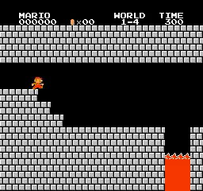
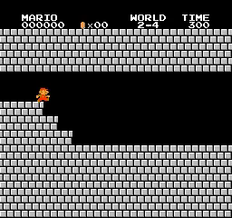
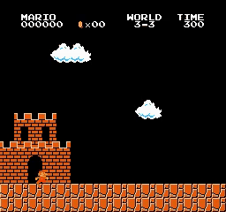
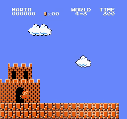
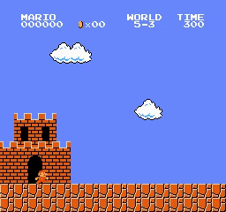

# Mario_PPO_RND
Playing Super Mario Bros with Proximal Policy Optimization (PPO) and Random Network Distillation (RND)

## Introduction

My PyTorch Proximal Policy Optimization (PPO) + Random Network Distillation (RND) implement to playing Super Mario Bros. There are [PPO paper](https://arxiv.org/abs/1707.06347) and [RND paper](https://arxiv.org/abs/1810.12894).

  
  
  
   
  
  
  
   
  
  
  
   
  
  
  
   
  
  
  
   
  
  
  
   
  
  
  
   
  
  
  
   
  <i>Results</i>

## Motivation

I just tried both [A2C](https://github.com/CVHvn/Mario_A2C) and [PPO](https://github.com/CVHvn/Mario_PPO), but my algorithms can't complete the hardest stage (stage 8-4). PPO only helped Mario complete 31/32 stages. When I try to play stage 8-4 with PPO, I encounter three problems:
- The reward system is very bad, causing Mario to be unable to complete this stage. Mario still earns rewards when he moves in a loop. I solved this similarly to how I handled stages 4-4 and 7-4.
- The coordinate system is poorly implemented. I found that some x positions are duplicated:
  - The first exact pipe has duplicate coordinates and is smaller than the road ahead.
  - The sea map has its x coordinates reset.
  - Because of this, I had to hard-code the reward system: Determining each x coordinate segment as a repeated line segment to set done = True and give a negative reward.
- Mario needs to find a hidden brick to complete this stage:
  - There is a water pipe that Mario must jump onto a hidden brick before entering.
  - If Mario goes right through the water pipe, he will enter a looped path.
  - The map is long before Mario is forced to discover this secret.
  - If we just prevent Mario from going right (avoiding the repeating path) as usual, he will learn that staying still is the best strategy instead of trying to find the hidden brick.
  - I tried three strategies with PPO, but they weren't effective enough, so I looked for other methods to let the agent explore better and combined RND with PPO to solve stage 8-4:
    - Give 50 rewards when Mario finds hidden bricks.
    - Give 50 rewards when Mario goes down the correct pipe.
    - Add more penalty reward when Mario die near hidden brick (-100 instead of -50 as other part of this map).
    - On my code, I always chose the last strategy because it seemed the fairest. Other strategies don't actually encourage Mario to explore the environment for the brick but rather just force him to follow the correct path. If you want add more reward when Mario goes down the correct pipe (option 2), you can set config.additional_bonus_state_8_4_option = "right_pipe".
  - Note: Actually, Mario can learn how to double jump to jump on the pipe without finding the brick, but this is very difficult and requires a lot of luck, difficult to recreate if you train again.

## How to use it

You can use my notebook for training and testing agent very easy:
* **Train your model** by running all cell before session test
* **Test your trained model** by running all cell except agent.train(), just pass your model path to agent.load_model(model_path)

Or you can use **train.py** and **test.py** if you don't want to use notebook:
* **Train your model** by running **train.py**: For example training for stage 1-4: python train.py --world 1 --stage 4 --num_envs 8
* **Test your trained model** by running **test.py**: For example testing for stage 1-4: python test.py --world 1 --stage 4 --pretrained_model best_model.pth --num_envs 2

## Trained models

You can find trained model in folder [trained_model](trained_model)

## Hyperparameters

How I Find Hyperparameters for Each Stage:
- First, I find optimal hyperparameters for stages 8-4 (I am doing this project just to complete this stage because normal PPO wins 31/32 other stages):
  - I find that a larger number of environments works better because it explores more things when run in parallel. I set the number of environments to 32 (when testing normal PPO, a number of environments larger than 16 has no effect).
  - As I saw with PPO, the learning steps need to be greater than the episode steps for stable training (except for easy stages) because the model will see a correct return. So, I set the learning steps to 756.
  - Because I can’t set the batch size to 64 (it doesn’t work and requires a smaller update proportion), I set the batch size to 256.
  - I tried tuning gamma and gamma_int in the range (0.9, 0.95, 0.99, 0.999), and I found that gamma = 0.99 and gamma_int = 0.99 work better.
  - I set update_proportion to 0.25 as [jcwleo RND](https://github.com/jcwleo/random-network-distillation-pytorch/blob/master/agents.py). When training stages 8-4, I didn’t change this parameter and didn’t realize the correlation between update_proportion and batch size (a larger batch size requires a smaller update_proportion; I will discuss this later).
  - I tuned int_adv_coef and ext_adv_coef and found that int_adv_coef = 1 and ext_adv_coef = 2 work better.
  - I tuned entropy_coef between 0.01 and 0.05 and found that 0.05 works better (because we need more exploration).
  - I didn’t change epoch = 10, lambda = 0.95, learning_rate = 7e-5, target_kl = 0.05, clip_param = 0.05, max_grad_norm = 0.5, norm_adv = False, V_coef = 0.5, and loss_type = ‘mse’ (because I think they are best when tuning normal PPO, just my biased experiment).
- After finding optimal hyperparameters for stages 8-4, I used them as the default and won almost all stages (only changing the number of environments to 8 or 16).
  - With other stages, I couldn’t complete them with the default hyperparameters, and I noticed that RND just makes training time slower (compared with normal PPO), so I set int_adv_coef = 0.1 and ext_adv_coef = 1. These hyperparameters helped me complete more difficult stages (you can revert to normal PPO, but if I want to test RND, I don’t want to disable it).
  - Now, I only have a few difficult stages left. I think that when I set the batch size to 64, RND updates more frequently, making intrinsic rewards ineffective. I tried setting update_proportion = 0.05 and batch size to 64, and then the algorithm worked, and I completed more stages.
  - Finally, I set loss_type to ‘hyber’ and completed all stages.
  - I randomly tuned entropy_coef between 0.01 and 0.05 (I don’t have enough evidence about the effect of this hyperparameter).
- Note: 
  - RL is very sensitive to hyperparameters, and some hyperparameters work for certain stages but not for others. Therefore, we need custom hyperparameters for some difficult stages like 5-3, 7-2, 8-1, and 8-4. I don’t have enough time and resources to find optimal hyperparameters that can complete all stages.
  - I use min-max scaling for instrinsic reward because divide by running std of intrinsic return as original paper not working with me:
    - I find some reason that make original normalization poor performance:
      - Initially, the intrinsic reward is very large, running std will be affected (very large). The intrinsic reward will decrease very strongly (usually from 1, 2 digits to 0.0x or 0.00x). The way to calculate running mean std will update mean and std very slowly, making the scaling intrinsic reward very small (because the running std is divided too large). It will take many steps for running mean std to actually return to a level that matches the intrinsic reward (0.0x or 0.00x), so the initial training time is almost wasted (intrinsic reward is too small or meaningless), even making the model learn poorly due to noisy rewards. --> I found that only updating and scaling intrinsic rewards after a few epochs worked (maybe after 10 learning steps).
      - I didn't initialize the network initially (default initialization by Pytorch), as mentioned in the DRND project, not initializing will make the RND output significantly smaller than the suggested model initialization. This may affect the results. --> you can try again (i don't have enough resources and found min-max scaling very good)
    - In some newer research and projects I read (including what I tried), scaling by dividing the running std of the intrinsic reward instead of its return works better (still only update the running std and scale after the first few training epochs to avoid noise) --> min-max-scale and dividing running std of the intrinsic reward both work well and depending on the algorithm generating the intrinsic reward and the environment will give different results --> you can try.

| World | Stage | num_envs | learn_step | batchsize | epoch | lambda | gamma | gamma_int | learning_rate | target_kl | clip_param | max_grad_norm | update_proportion  | norm_adv | int_adv_coef | ext_adv_coef | V_coef | entropy_coef | loss_type | training_step | training_time |
|-------|-------|----------|------------|-----------|-------|--------|-------|-----------|---------------|-----------|------------|---------------|--------|----------|--------------|--------------|--------|--------------|-----------|---------------|---------------|
| default     |      | 8        | 512        | 256       | 10    | 0.95   | 0.99  | 0.99      | 7e-5      | 0.05      | 0.2        | 0.5           | 0.25   | FALSE    | 1            | 2            | 0.5    | 0.05         | mse       | 435990        | 5:30:41       |
| 1     | 1     | 8        | 512        | 256       | 10    | 0.95   | 0.99  | 0.99      | 7e-5      | 0.05      | 0.2        | 0.5           | 0.25   | FALSE    | 1            | 2            | 0.5    | 0.05         | mse       | 435990        | 5:30:41       |
| 1     | 2     | 8        | 512        | 256       | 10    | 0.95   | 0.99  | 0.99      | 7e-5      | 0.05      | 0.2        | 0.5           | 0.25   | FALSE    | 1            | 2            | 0.5    | 0.05         | mse       | 467440        | 7:43:46       |
| 1     | 3     | 16       | 512        | 64        | 10    | 0.95   | 0.99  | 0.99      | 7e-5      | 0.05      | 0.2        | 0.5           | 0.05   | FALSE    | 0.1          | 1            | 0.5    | 0.05         | mse       | 444917        | 15:32:29      |
| 1     | 4     | 8        | 512        | 256       | 10    | 0.95   | 0.99  | 0.99      | 7e-5      | 0.05      | 0.2        | 0.5           | 0.25   | FALSE    | 1            | 2            | 0.5    | 0.05         | mse       | 64982         | 0:42:23       |
| 2     | 1     | 8        | 512        | 256       | 10    | 0.95   | 0.99  | 0.99      | 7e-5      | 0.05      | 0.2        | 0.5           | 0.25   | FALSE    | 1            | 2            | 0.5    | 0.05         | mse       | 1202627       | 14:45:26      |
| 2     | 2     | 16       | 512        | 256       | 10    | 0.95   | 0.99  | 0.99      | 7e-5      | 0.05      | 0.2        | 0.5           | 0.25   | FALSE    | 0.1          | 1            | 0.5    | 0.01         | mse       | 1876990       | 1 day, 18:37:18 |
| 2     | 3     | 8        | 512        | 256       | 10    | 0.95   | 0.99  | 0.99      | 7e-5      | 0.05      | 0.2        | 0.5           | 0.25   | FALSE    | 1            | 2            | 0.5    | 0.05         | mse       | 392697        | 6:06:10       |
| 2     | 4     | 8        | 512        | 256       | 10    | 0.95   | 0.99  | 0.99      | 7e-5      | 0.05      | 0.2        | 0.5           | 0.25   | FALSE    | 1            | 2            | 0.5    | 0.05         | mse       | 145339        | 2:16:03       |
| 3     | 1     | 16       | 512        | 256       | 10    | 0.95   | 0.99  | 0.99      | 7e-5      | 0.05      | 0.2        | 0.5           | 0.25   | FALSE    | 1            | 2            | 0.5    | 0.05         | mse       | 193534        | 4:51:21       |
| 3     | 2     | 8        | 512        | 256       | 10    | 0.95   | 0.99  | 0.99      | 7e-5      | 0.05      | 0.2        | 0.5           | 0.25   | FALSE    | 1            | 2            | 0.5    | 0.05         | mse       | 195001        | 3:15:37       |
| 3     | 3     | 16       | 512        | 256       | 10    | 0.95   | 0.99  | 0.99      | 7e-5      | 0.05      | 0.2        | 0.5           | 0.25   | FALSE    | 1            | 2            | 0.5    | 0.05         | mse       | 843736        | 16:24:42      |
| 3     | 4     | 8        | 512        | 256       | 10    | 0.95   | 0.99  | 0.99      | 7e-5      | 0.05      | 0.2        | 0.5           | 0.25   | FALSE    | 1            | 2            | 0.5    | 0.05         | mse       | 118255        | 1:39:47       |
| 4     | 1     | 8        | 512        | 256       | 10    | 0.95   | 0.99  | 0.99      | 7e-5      | 0.05      | 0.2        | 0.5           | 0.25   | FALSE    | 1            | 2            | 0.5    | 0.05         | mse       | 219639        | 2:39:24       |
| 4     | 2     | 16       | 512        | 256       | 10    | 0.95   | 0.99  | 0.99      | 7e-5      | 0.05      | 0.2        | 0.5           | 0.25   | FALSE    | 1            | 2            | 0.5    | 0.05         | mse       | 417239        | 10:34:17      |
| 4     | 3     | 16       | 512        | 256       | 10    | 0.95   | 0.99  | 0.99      | 7e-5      | 0.05      | 0.2        | 0.5           | 0.25   | FALSE    | 0.1          | 1            | 0.5    | 0.01         | mse       | 211948        | 5:19:50       |
| 4     | 4     | 16       | 512        | 256       | 10    | 0.95   | 0.99  | 0.99      | 7e-5      | 0.05      | 0.2        | 0.5           | 0.25   | FALSE    | 1            | 2            | 0.5    | 0.05         | mse       | 111064        | 2:48:40       |
| 5     | 1     | 8        | 512        | 256       | 10    | 0.95   | 0.99  | 0.99      | 7e-5      | 0.05      | 0.2        | 0.5           | 0.25   | FALSE    | 1            | 2            | 0.5    | 0.05         | mse       | 268275        | 3:11:07       |
| 5     | 2     | 8        | 512        | 256       | 10    | 0.95   | 0.99  | 0.99      | 7e-5      | 0.05      | 0.2        | 0.5           | 0.25   | FALSE    | 1            | 2            | 0.5    | 0.05         | mse       | 1891820       | 1 day, 0:59:46 |
| 5     | 3     | 16       | 512        | 64        | 10    | 0.95   | 0.99  | 0.99      | 7e-5      | 0.05      | 0.2        | 0.5           | 0.05   | FALSE    | 0.1          | 1            | 0.5    | 0.05         | huber     | 1739262       | 2 days, 2:44:45 |
| 5     | 4     | 16       | 512        | 256       | 10    | 0.95   | 0.99  | 0.99      | 7e-5      | 0.05      | 0.2        | 0.5           | 0.25   | FALSE    | 1            | 2            | 0.5    | 0.05         | mse       | 370659        | 9:21:28       |
| 6     | 1     | 8        | 512        | 256       | 10    | 0.95   | 0.99  | 0.99      | 7e-5      | 0.05      | 0.2        | 0.5           | 0.25   | FALSE    | 1            | 2            | 0.5    | 0.05         | mse       | 244212        | 3:03:29       |
| 6     | 2     | 16       | 512        | 256       | 10    | 0.95   | 0.99  | 0.99      | 7e-5      | 0.05      | 0.2        | 0.5           | 0.25   | FALSE    | 1            | 2            | 0.5    | 0.05         | mse       | 535523        | 11:57:35      |
| 6     | 3     | 16       | 512        | 256       | 10    | 0.95   | 0.99  | 0.99      | 7e-5      | 0.05      | 0.2        | 0.5           | 0.25   | FALSE    | 1            | 2            | 0.5    | 0.01         | mse       | 153598        | 2:46:04       |
| 6     | 4     | 8        | 512        | 256       | 10    | 0.95   | 0.99  | 0.99      | 7e-5      | 0.05      | 0.2        | 0.5           | 0.25   | FALSE    | 1            | 2            | 0.5    | 0.05         | mse       | 498686        | 5:42:43       |
| 7     | 1     | 8        | 512        | 256       | 10    | 0.95   | 0.99  | 0.99      | 7e-5      | 0.05      | 0.2        | 0.5           | 0.25   | FALSE    | 1            | 2            | 0.5    | 0.05         | mse       | 500220        | 6:06:49       |
| 7     | 2     | 16       | 512        | 64        | 10    | 0.95   | 0.99  | 0.99      | 7e-5      | 0.05      | 0.2        | 0.5           | 0.05   | FALSE    | 0.1          | 1            | 0.5    | 0.05         | mse       | 3218417       | 2 days, 23:13:37 |
| 7     | 3     | 8        | 512        | 256       | 10    | 0.95   | 0.99  | 0.99      | 7e-5      | 0.05      | 0.2        | 0.5           | 0.25   | FALSE    | 1            | 2            | 0.5    | 0.05         | mse       | 398336        | 4:39:01       |
| 7     | 4     | 8        | 512        | 256       | 10    | 0.95   | 0.99  | 0.99      | 7e-5      | 0.05      | 0.2        | 0.5           | 0.25   | FALSE    | 1            | 2            | 0.5    | 0.05         | mse       | 201684        | 2:56:41       |
| 8     | 1     | 16       | 512        | 64        | 10    | 0.95   | 0.99  | 0.99      | 7e-5      | 0.05      | 0.2        | 0.5           | 0.05   | FALSE    | 0.1          | 1            | 0.5    | 0.05         | huber     | 3058672       | 3 days, 22:58:34 |
| 8     | 2     | 16       | 512        | 256       | 10    | 0.95   | 0.99  | 0.99      | 7e-5      | 0.05      | 0.2        | 0.5           | 0.25   | FALSE    | 1            | 2            | 0.5    | 0.05         | mse       | 723940        | 17:21:15      |
| 8     | 3     | 16       | 512        | 256       | 10    | 0.95   | 0.99  | 0.99      | 7e-5      | 0.05      | 0.2        | 0.5           | 0.25   | FALSE    | 1            | 2            | 0.5    | 0.05         | mse       | 593399        | 13:29:12      |
| 8     | 4     | 32       | 756        | 256       | 10    | 0.95   | 0.99  | 0.99      | 7e-5      | 0.05      | 0.2        | 0.5           | 0.25   | FALSE    | 1            | 2            | 0.5    | 0.05         | mse       | 985820        | 1 day, 7:48:34 |

## Questions

* Is this code guaranteed to complete the stages if you try training?
  
  - This hyperparameter does not guarantee you will complete the stage. But I am sure that you can win with this hyperparameter except you have a unlucky day (need 2-3 times to win because of randomness)

* How long do you train agents?
  
  - Within a few hours to more than 1 day. Time depends on hardware, I use many different hardware so time will not be accurate.

* How can you improve this code?
  
  - You can separate the test agent part into a separate thread or process. I'm not good at multi-threaded programming so I don't do this.
  - You can tuning hyperparameters
  - You can apply new network architectures (like attention), maybe it work?

* What is the importance of RND?

  - RND mainly helps complete stage 8-4, which requires more exploration. 
  - Personally, I feel it doesn't help other stages and slows down the training speed. 
  - RND adds many hyperparameters making it difficult to choose hyperparameters. But we all know that hyperparameters greatly affect RL.

## Discussion

* About Hyperparameters

  - **Learning rate scheduler**: I tried using a linear learning rate scheduler, but if the learning rate decreases before the agent explores enough, the agent will not learn anything due to the low learning rate. Therefore, I decided not to use it. One way to make the learning rate scheduler effective is to increase the number of training steps, but that requires a lot of time and resources.

  - **Entropy coefficient**: When I experimented with other algorithms, I found that the entropy coefficient is an important parameter. Only a high entropy value (e.g., 0.05) helped the agent solve level 8-4. However, high entropy slows down training and can even cause the agent to get stuck in a suboptimal policy (sometimes the agent gets through the hardest part to explore at stage 8-4, but takes forever to complete the rest because of high entropy. I often have to train more steps to complete even though the later parts are easier). I believe we need a good way to schedule the entropy coefficient (or automatically adjust it). Some people use a linear scheduler, but like with the learning rate, if we reduce it too soon—before the agent has explored enough—it can lead to a poor policy. One solution is to train for more steps (e.g., 10 million or more), but that's expensive. Another trick is to manually reduce the entropy coefficient (e.g., to 0.01) after the agent passes a difficult point (like the pipe in 8-4 or the loop in 4-4). But this approach treats the environment and makes it artificially easier.

  - **Update proportion**: This is an important parameter. If we set it too high (\~1), RND will overfit (all states will have the same intrinsic reward). If we set it too low (< 0.01), RND may become too random or fail to learn properly, which slows down training because the RND model doesn’t receive enough updates.

* Reward System

  - Reward scaling can have a big impact on training. A good scaling strategy helps the agent learn better, but requires a lot of tuning. We could try scaling the reward to ranges like \[-1, 1] or \[-5, 5]. However, I currently don’t have enough resources to tune the reward system.
  - Intrinsic reward scaling have a big impact on training. Without normalize, RND almost doesn't work because the output is too small. As mentioned above, there are 3 ways: min-max scaling, dividing the running std of the intrinsic reward, and dividing the running std of the intrinsic return:
    - In this project, I use min-max scaling because it works.
    - Dividing the running std of the intrinsic return doesn't work well (I tried).
    - Dividing the running std of the intrinsic reward might work well (I haven't tried).
    - However, if you want to use running std (both ways), you need to be careful in updating and dividing (you should refer to other RND projects or test it yourself), if you divide the running std from the beginning, the algorithm will be quite bad.
    - Note that we should only divide running std instead of subtracting mean before dividing std because subtracting mean will give a negative reward and may distort the value you want to convey from the intrinsic reward (instead of adding points to novel states and doing nothing to frequent states, it may make the policy stay away from frequent states because the intrinsic reward of frequent states after subtracting mean will be negative). However, this way can work, you can try!

* One Agent for All Stages

  - I tried training one agent to play 32 stages using three setups:
  
    - **32 environments (1 per stage)**: The agent learned very slowly and I had to stop training. It could only win a few easier stages.
    - **128 environments (4 per stage)**: The agent was able to complete all the easy stages at different points in time. I remember it could complete 26/32 stages, but not all at the same time. At any given time, it could complete a maximum of 13/32 stages. It couldn’t beat any hard stages (like 1-3, 5-3, 4-4, 8-4), even during training with random moves.
    - **Increased number of environments for hard stages**: This helped the agent complete more hard stages, but it slowed down learning on the easier ones. Even then, the agent couldn’t complete more multiple stages at once.
  
  - **My conclusions**:
  
    - We need more training steps to complete more stages.
    - We might need to try stronger algorithms like MuZero.
    - We might also need better strategies, such as continuing learning: completing stages one by one. It could help to start with harder stages (like 8-4 or 5-3) because the agent will find it easier to complete the easier ones later.

## Requirements

* **python 3>3.6**
* **gym==0.25.2**
* **gym-super-mario-bros==7.4.0**
* **imageio**
* **imageio-ffmpeg**
* **cv2**
* **pytorch** 
* **numpy**

## Acknowledgements
With my code, I can completed all 32/32 stages of Super Mario Bros. This code included new custom reward system (for stage 8-4) and PPO+RND for agent training.

## Reference
* [CVHvn PPO](https://github.com/CVHvn/Mario_PPO)
* [Stable-baseline3 PPO](https://stable-baselines3.readthedocs.io/en/master/_modules/stable_baselines3/ppo/ppo.html#PPO)
* [lazyprogrammer A2C](https://github.com/lazyprogrammer/machine_learning_examples/tree/master/rl3/a2c)
* [jcwleo RND](https://github.com/jcwleo/random-network-distillation-pytorch/blob/master/utils.py)
* [DI-engine RND](https://opendilab.github.io/DI-engine/12_policies/rnd.html)
* [vwxyzjn cleanrl/ppo_rnd_envpool.py](https://github.com/vwxyzjn/cleanrl/blob/master/cleanrl/ppo_rnd_envpool.py)
